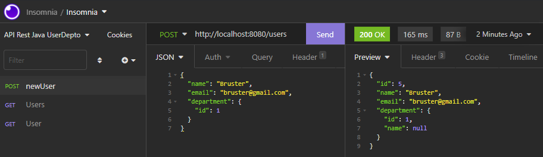
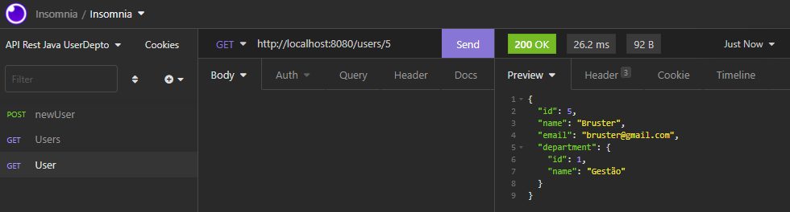
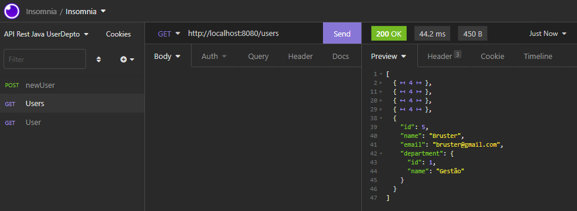

# :star: API Rest using Java Web with SpringBoot

:information_source: Exploring the relationship between users and departments.

- Scroll down for demonstrations

## Endpoints 
- /users -> (get) Search all users
- /users -> (post) Save a new user
- /users/{id} -> Search a user by their id

## Dependencies
- Spring Data JPA
- Spring Web
- H2 Database

## Tools

Class steps
- Create the project with [Spring Initializr] :white_check_mark:
- Implement the domain model :white_check_mark:
- Object-relational mapping with JPA :white_check_mark:
- Configure the H2 database :white_check_mark:
- Create the endpoints da API REST :white_check_mark:

## Demonstrations 

- Save a new user
 

- Search a user by their id

- Search all users

* Java v11

[Spring Initializr]: https://start.spring.io
